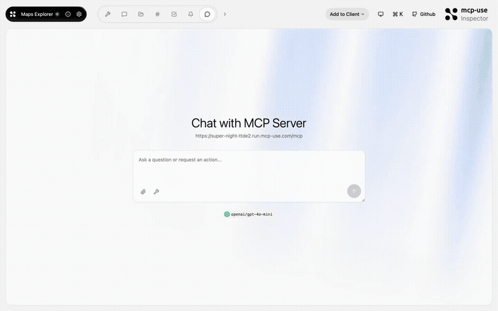
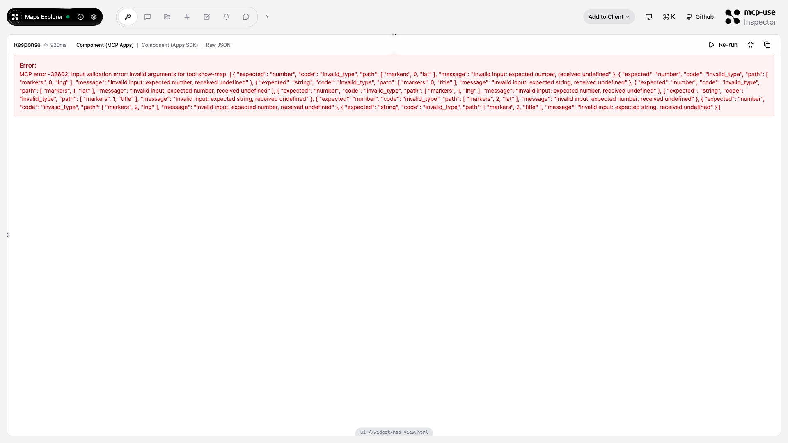

# Maps Explorer — Leaflet maps in your chat

<p>
  <a href="https://github.com/mcp-use/mcp-use">Built with <b>mcp-use</b></a>
  &nbsp;
  <a href="https://github.com/mcp-use/mcp-use">
    
  </a>
</p>

Interactive safety map MCP App powered by [Leaflet](https://leafletjs.com/). The model centers the map, drops a blue current-position dot, adds a dense field of red/orange incident bookmarks, draws a chain of green route points, and ends on one purple safe destination.



## Try it now

Connect to the hosted instance:

```
https://super-night-ttde2.run.mcp-use.com/mcp
```

Or open the [Inspector](https://inspector.manufact.com/inspector?autoConnect=https%3A%2F%2Fsuper-night-ttde2.run.mcp-use.com%2Fmcp) to test it interactively.

### Setup on ChatGPT

1. Open **Settings** > **Apps and Connectors** > **Advanced Settings** and enable **Developer Mode**
2. Go to **Connectors** > **Create**, name it "Maps Explorer", paste the URL above
3. In a new chat, click **+** > **More** and select the Maps Explorer connector

### Setup on Claude

1. Open **Settings** > **Connectors** > **Add custom connector**
2. Paste the URL above and save
3. The Maps Explorer tools will be available in new conversations

## Features

- **Dense incident field** — every `show-map` call creates many fresh red/orange danger bookmarks
- **Current position marker** — the requested center is always shown as your blue position dot
- **Suggested route chain** — green points create a readable path from your position to safety
- **Single safe destination** — one purple point marks the suggested safest destination
- **Streaming markers** — pins still appear on the map as the model adds them
- **Colored pins** — red, blue, green, orange, purple markers
- **Popup descriptions** — click markers for details
- **Zoom & pan** — fully interactive Leaflet map
- **Fullscreen mode** — expand the map for immersive viewing

## Tools

| Tool | Description |
|------|-------------|
| `show-map` | Display a safety map with incidents, route points, and one destination |
| `show-emergency-briefing` | Display a simulated move-prep briefing with latest updates, weather, packing advice, and departure guidance for a position |
| `get-place-details` | Look up place details by name |
| `add-markers` | Add more markers to an existing map |

### Demo prompt idea

Ask the model something like:

```text
I have decided to leave my current area during an emergency.
Use show-emergency-briefing for my position 32.0853, 34.7818 and destination "North shelter".
Give me what to pack, weather conditions, and a short before-you-leave checklist.
Use mock data.
```

## Available Widgets

| Widget | Preview |
|--------|---------|
| `map-view` |  |

## Local development

```bash
git clone https://github.com/mcp-use/mcp-maps-explorer.git
cd mcp-maps-explorer
npm install
npm run dev
```

## Deploy

```bash
npx mcp-use deploy
```

## Built with

- [mcp-use](https://github.com/mcp-use/mcp-use) — MCP server framework
- [Leaflet](https://leafletjs.com/) — interactive map library (bundled, no CDN required)

## License

MIT
